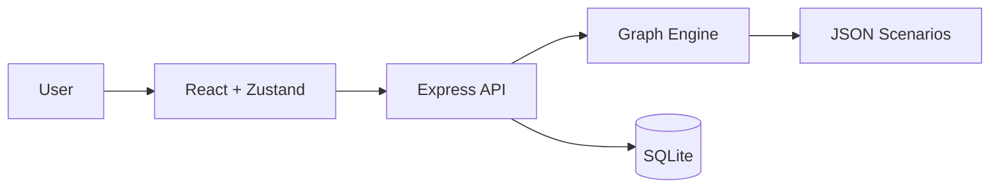

# Graph-Based Corporate Conversation Trainer


A full-stack deterministic conversation training system that uses finite-state graph traversal instead of LLMs.

## Features
- Deterministic dialogue traversal (exact, regex, intent similarity, fuzzy fallback)
- SQLite persistence for conversations and interaction logs
- Editable scenario JSON files with three sample scenarios
- React chat interface with quick reply buttons
- Graph inspector panel for real-time scenario node visibility
- Validation endpoint for graph edge integrity

## Architecture


## Monorepo Structure
- `apps/api` Express backend, graph engine, SQLite, scenario files
- `apps/web` React frontend chat + graph viewer
- `packages/types` shared TypeScript interfaces
- `packages/graph-schema` schema module
- `docs/adr` architecture decision records

## Quick Start
```bash
npm install
npm run dev
```
- API: `http://localhost:4000`
- Web: `http://localhost:5173`

## API
- `POST /api/conversations` start conversation
- `POST /api/conversations/:id/message` send user input
- `GET /api/scenarios` list scenarios
- `GET /api/scenarios/:id/graph` get scenario graph
- `POST /api/scenarios/:id/validate` validate graph references

## Performance Benchmark
Run 1000 traversals quickly with a script or test harness against `GraphEngine.processInput`; this architecture avoids external API latency by staying local and deterministic.

## License Suggestion
MIT
